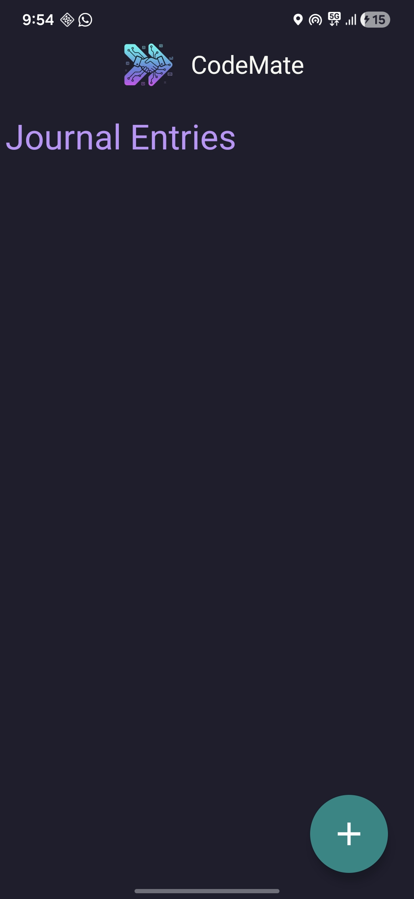
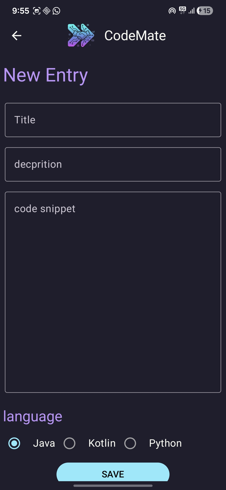
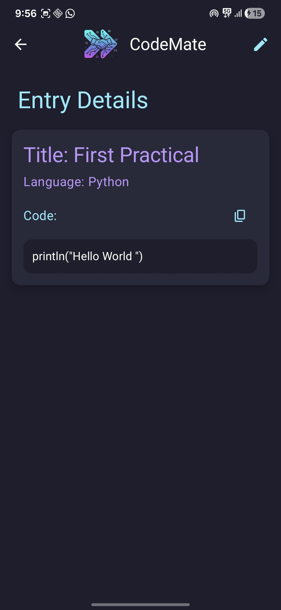
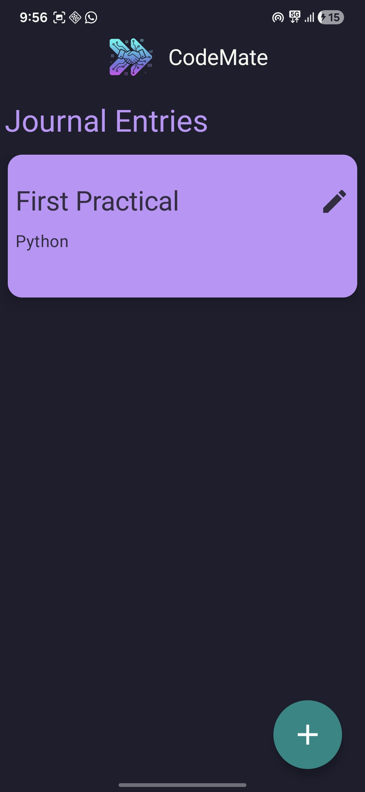

# 📘 CodeMate — Learn Coding the Smart Way

---

*CodeMate* is a clean and lightweight coding study companion built using **Kotlin** and **Jetpack Compose**.  
It allows users to explore topic-wise programming notes and create/store their own personal notes.  
Designed for simplicity, clarity, and a smooth learning experience. 💡

---

## 🚀 Features

📚 **Study Material** – Topic-wise notes for C, Java, Python, DBMS, OOP, and more  
📝 **Personal Notes** – Add, update, and save your own study notes  
💾 **Persistent Storage** – Data stays even after fully closing the app  
🎨 **Modern Compose UI** – Material 3 design, smooth UI flow  
⚡ **Fast & Lightweight** – Quick launch and clean architecture  

---

## 🧠 Tech Stack

| Category | Technology |
|-----------|-------------|
| *Language* | Kotlin |
| *UI Framework* | Jetpack Compose |
| *Architecture* | MVVM (Model–View–ViewModel) |
| *Storage* | Room / DataStore |
| *Design System* | Material 3 |
| *IDE* | Android Studio |

---

## 🖼 Screenshots

| Homepage | Data Entry Page | Entry Details Page | After Entry Page |
|:---------:|:------------------:|:----------------------:|:------------------:|
|  |  |  |  |

---

## 🔮 Future Improvements

🤖 AI Assistant for code explanations  
🔍 Search functionality for notes  
☁️ Cloud backup & sync  
🏷 Tags and categories for better organization  
📚 Additional programming topics  

---

## 👨‍💻 Author
Developed with ❤ by **Deep Patel**

---
